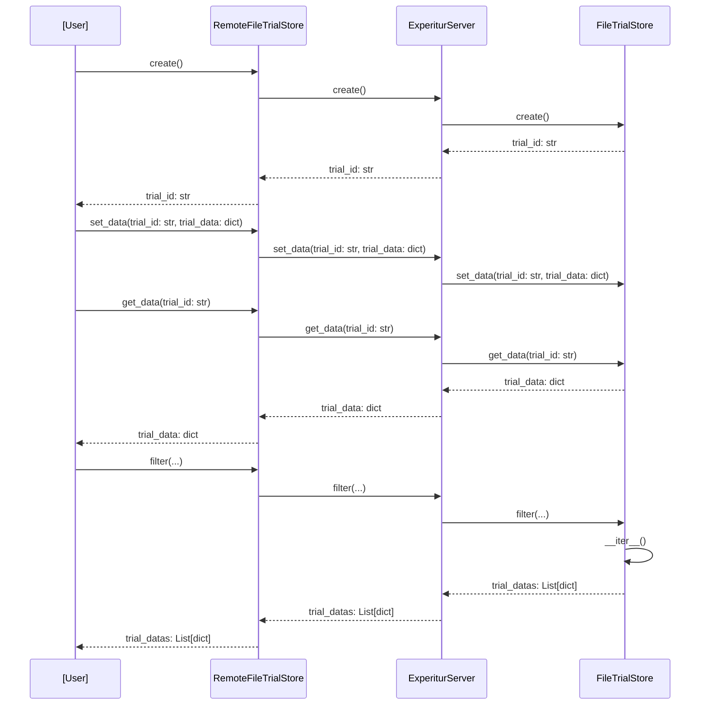

```mermaid

sequenceDiagram
    [User]->>RemoteFileTrialStore: create()
    RemoteFileTrialStore->>ExperiturServer: create()
    ExperiturServer->>FileTrialStore: create()
    FileTrialStore-->>ExperiturServer: trial_id: str
    ExperiturServer-->>RemoteFileTrialStore: trial_id: str
    RemoteFileTrialStore-->>[User]: trial_id: str

    [User]->>RemoteFileTrialStore: set_data(trial_id: str, trial_data: dict)
    RemoteFileTrialStore->>ExperiturServer: set_data(trial_id: str, trial_data: dict)
    ExperiturServer->>FileTrialStore: set_data(trial_id: str, trial_data: dict)

    [User]->>RemoteFileTrialStore: get_data(trial_id: str)
    RemoteFileTrialStore->>ExperiturServer: get_data(trial_id: str)
    ExperiturServer->>FileTrialStore: get_data(trial_id: str)
    FileTrialStore-->>ExperiturServer: trial_data: dict
    ExperiturServer-->>RemoteFileTrialStore: trial_data: dict
    RemoteFileTrialStore-->>[User]: trial_data: dict

    [User]->>RemoteFileTrialStore: filter(...)
    RemoteFileTrialStore->>ExperiturServer: filter(...)
    ExperiturServer->>FileTrialStore: filter(...)
    FileTrialStore->>FileTrialStore: __iter__()
    FileTrialStore-->>ExperiturServer: trial_datas: List[dict]
    ExperiturServer-->>RemoteFileTrialStore: trial_datas: List[dict]
    RemoteFileTrialStore-->>[User]: trial_datas: List[dict]


```